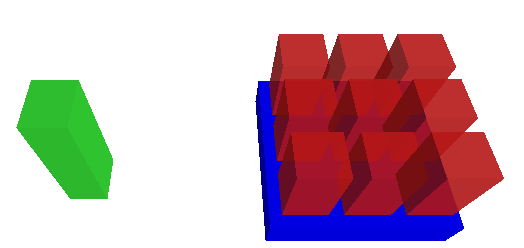
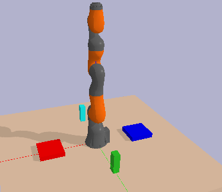
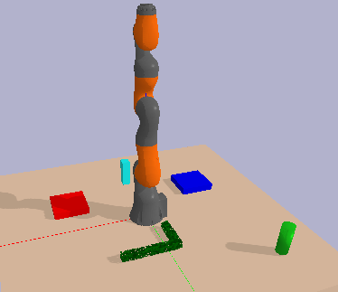
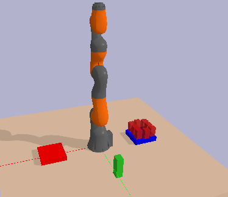
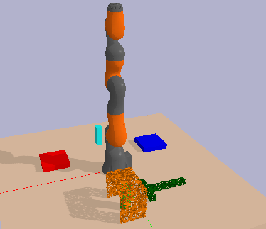
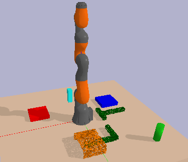
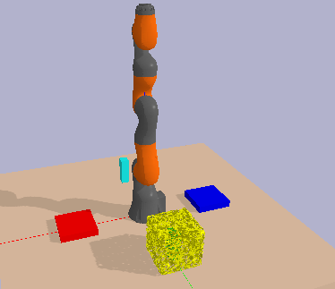
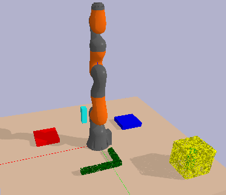

# Task, Affordance, And Motion Planning (TAAMP)pproach

We used TAAMP, which is an affordance-based TAMP approach to expedite the search on tasks with contrained environment, or tasks that are infeasible due to environmental constraints. In this approach, we checked whether the environment allow the effects of certain actions. Or in other words, whether the environment can afford these actions. This is because some constraints imposed by the context, such as a very crowded surface that does not allow more objects to be placed on top of it as shown in the image below, is independent of robot configurations (e.g., grasp poses of the object). We refer to the quality of being "place-able" as affordance, and each action may have different affordances.



We build upon PDDLStream, the state-of-the-art TAMP planner. The source code of PDDLStream can be found [here](https://github.com/caelan/pddlstream), and the original readme file can be found [here](PDDLSTREAM_README.md)

## Installation

```
$ git clone --recursive git@github.com:ScazLab/Affordance-based-TAMP.git
$ cd Affordance-based-TAMP
Affordance-based-TAMP$ ./downward/build.py
```

Install the dependencies:
```
$ pip install pybullet numpy scipy
```

## Demonstrations

This repository contains the demonstrations in simulation that are included in the paper. There are four types of tasks: unconstrained tasks, constrained tasks 1, constrained tasks 2, and infeasible tasks. Each type of task has a demonstration without the tool and one with the tool. In these tasks, a robot should cook the "celery" (the green block) by first placing it on the "sink" (the blue surface) and then placing it on the "stove" (the red surface). The "radish" (the cyan block) is not directly related to the goal. Images of each task is shown below:











We compared our results with PDDLStream which doesn't have these affordance checks, and used them as control conditions.

### Preliminaries

Before you ran the code, you should update the directories in the urdf files in `examples/pybullet/utils/models` and in `examples/pybullet/utils/models/drake/objects` with the prefix `meiying_`. I attempted to use relative paths but the urdf cannot find the correct point cloud file. I apologize for any inconvenience.

You also need to correct the path in the `examples/pybullet/utils/model/bb.json`, `learned_samples\ur/simulator\pointcloud\tool.json`, the `get_package_dir()` function in `examples/pybullet/utils/pybullet_tools/learn_affordance_tamp/constants.py`. This is awarkward coding style, but I run out of time to fix it.

Note: If you would like to learn the affordances and use the generic affordance tests, you should train the tasks with TRI-STAR (steps omitted here. Please refer to the TRI-STAR readme file to see how to use the package; You also need to update the file location of the learned affordances in the function `\_get_goal_range` in `meiying_primitives.py`).

### Unconstrained Tasks

The non-tool-use version was orginally included in [PDDLStream](https://github.com/caelan/pddlstream/tree/main/examples/pybullet/kuka). We included this task to ensure that the task is friendly to the current planners. In the tool-use version, the robot should first retrieve the the green block with the L-shaped tool.

Demonstrations 
* Non-Tool-Use: `Affordance-based-TAMP$ python -m examples.pybullet.meiying_tamp_1_test_learn.run`
* Tool-Use: `Affordance-based-TAMP$ python -m examples.pybullet.meiying_tamp_2_test_learn.run`
* Non-Tool-Use Control: `Affordance-based-TAMP$ python -m examples.pybullet.meiying_tamp_1_control.run`
* Tool-Use Control: `Affordance-based-TAMP$ python -m examples.pybullet.meiying_tamp_2_control.run`

You can add the `-viewer` option to visualize the task and the solution, for example:
`Affordance-based-TAMP$ python -m examples.pybullet.meiying_tamp_1_test.run -viewer`

### Constrained Tasks 1

In these tasks, the environments are more constrainted than constrained tasks. However, the robots does not need to relocate objects that are not directly related to the goal (e.g., the cyan block). In the non-tool-use task, the robot needs to place the green block on the relatively crowded vlue surface which has limited space for the green block. In the tool-use task, the robot needs to retrieve the green block hiding under the orange tunnel with a T-shaped tool. In these tasks, the red blocks are immovable.

Demonstrations 
* Non-Tool-Use: `Affordance-based-TAMP$ python -m examples.pybullet.meiying_tamp_3_test_learn.run`
* Tool-Use: `Affordance-based-TAMP$ python -m examples.pybullet.meiying_tamp_4_test_learn.run`
* Non-Tool-Use Control: `Affordance-based-TAMP$ python -m examples.pybullet.meiying_tamp_3_control.run`
* Tool-Use Control: `Affordance-based-TAMP$ python -m examples.pybullet.meiying_tamp_4_control.run`

### Constrained Tasks 2

In these tasks, the robots need to relocate objects that are not directly related to the goal (e.g., the cyan block). In the non-tool-use task, the robot needs to relocate the cyan block to make room for the green block. In the tool-use task, the robot needs to retrieve the L-shaped tool hiding under the orange tunnel with a T-shaped tool, in order to pull the green block towards itself with the T-shaped tool. In these tasks, the red blocks are also immovable.

Demonstrations 
* Non-Tool-Use: `Affordance-based-TAMP$ python -m examples.pybullet.meiying_tamp_5_test_learn.run`
* Tool-Use: `Affordance-based-TAMP$ python -m examples.pybullet.meiying_tamp_6_test_learn.run`
* Non-Tool-Use Control: `Affordance-based-TAMP$ python -m examples.pybullet.meiying_tamp_5_control.run`
* Tool-Use Control: `Affordance-based-TAMP$ python -m examples.pybullet.meiying_tamp_6_control.run`

### Infeasible Tasks

In these tasks, the robots cannot complete the tasks. The green block is hidding under immovable yellow contrainer, which makes it impossible to pick, pull or push the green block to retrieve it.

Demonstrations 
* Non-Tool-Use: `Affordance-based-TAMP$ python -m examples.pybullet.meiying_tamp_7_test_learn.run`
* Tool-Use: `Affordance-based-TAMP$ python -m examples.pybullet.meiying_tamp_8_test_learn.run`
* Non-Tool-Use Control: `Affordance-based-TAMP$ python -m examples.pybullet.meiying_tamp_7_control.run`
* Tool-Use Control: `Affordance-based-TAMP$ python -m examples.pybullet.meiying_tamp_8_control.run`

## Adding New Examples
To add a new example, one should first create a folder under `examples/pybullet`. In this folder, one should create a `__init__.py` to initialize this folder as a package, a `domain.pddl` which defines the problem (e.g., the actions), a `stream.pddl` with the streams to certify predicates or generate samples, and a `run.py` that defines the environment. 

If a new object is needed, one should create an urdf under `examples/pybullet/utils/models`. If a pointcloud/mesh is needed, one should create an `obj` file, as well as a ply file with the same name for collision detection purposes. 

When a new action is needed, the names of the correspondence affordance checks in the `stream.pddl` should starts with the `test` and also include the word `feasible` so that these checks will be applied earlier in the search process when necessary.

When sampling for certain affordances are needed, and when fluents are needed (currently only support the AtPose fluent), the name of the affordance samplers should be added to `./pddlstream/algorithms/scheduling/apply_fluents.py` line 98. Note: this is by no means be considered as good coding style, but I did not have time to completely refactor the code. The purpose of this source code is to show the benefit of considering affordances.

Note: I only performed a minor code refactor before I upload this source code due to time constraints. I apologize for the messiness of the code.

